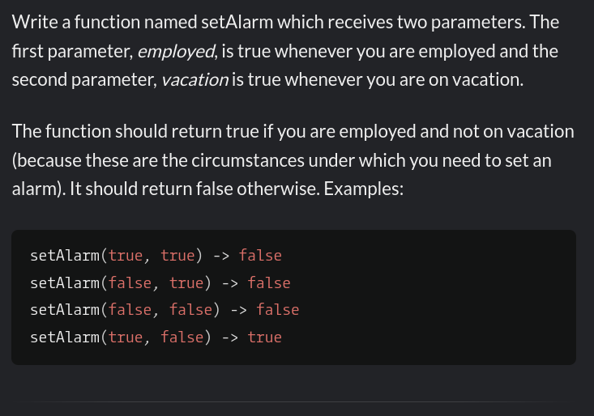

# THM : Surfer

Start with **Nmap** scan

<pre class="language-bash"><code class="lang-bash"> > sudo nmap -A -T4 -vv  10.10.14.234 
<strong>
</strong><strong>PORT   STATE SERVICE REASON         VERSION                                                                                                                                                 
</strong>22/tcp open  ssh     syn-ack ttl 63 OpenSSH 8.2p1 Ubuntu 4ubuntu0.4 (Ubuntu Linux; protocol 2.0)                                                                                            
| ssh-hostkey:                                                                                                                                                                              
|   3072 9f:5f:74:e4:94:23:ef:29:ca:f5:31:65:05:c9:2d:6e (RSA)                                                                                                                              
| ssh-rsa AAAAB3NzaC1yc2EAAAADAQABAAABgQDXRfYGhOAtMsuSt0TxQQsm2+HaLlKHXdCaFVWqsnJxynE0Hhyvasp9ix2hLzYI4eWMWlGU9p/Oq17pKtbmN/IFD05FvXPE81soXLpWH30L761xrL/qiIGWD0j2hQnTHn4aULF6D3TgARQCy4MOI6
28WtHUE2yk9CDRbXlZgFqLRmI7JEartPPR/j6sOgYszckJ+kkWPB7GABSAPLaORZ0o27Akib8Gc67TvifyKNatPfVgKqucc2IHCyEQxkQjRkTroRB8e2G9tPZ0VyU8ObnZPSIk+8F90GPqqiy5gXxWhr+iQwu9RQv0l4YL8cOzd/GUaSwbAK90aKwAa9
OFL42dExvp74f6ruX7YylMwvPGmKm0lCYlctoJ88U3F+B4qtpP2Mdj4raMSV5IIO777H1eFtVDVcaYaNvOcbduxqVqBFLjc7/HzxB+dTxVPE5FlgGXlhn1Zv2zE+zAeNDkmVU4SiJ/VUU1Xh7QrhIMxCHSzHsE+z/b2quJaFEHpxXDDVE=          
|   256 a3:48:45:cf:27:cc:97:b9:bc:dd:69:2f:8b:77:c8:29 (ECDSA)                                                                                                                             
| ecdsa-sha2-nistp256 AAAAE2VjZHNhLXNoYTItbmlzdHAyNTYAAAAIbmlzdHAyNTYAAABBBGJwMCEbjHLOeRuCmd4fHRowc8c2hw8LQYp5xi1XQ0hz8NuJvSm9myEoA1CptS5Iek7r//tsVgjaNRD2cVpbjPQ=                          
|   256 0f:36:55:44:bf:dc:a7:cc:bc:39:b3:dd:92:b7:d9:2c (ED25519)                                                                                                                           
|_ssh-ed25519 AAAAC3NzaC1lZDI1NTE5AAAAIEMTfc8ljkObmCbO/17oQ/rVF5wBhgC2cj+0U5B5EKNb                                                                                                          
80/tcp open  http    syn-ack ttl 62 Apache httpd 2.4.38 ((Debian))                                                                                                                          
| http-cookie-flags:                                                                                                                                                                        
|   /:                                                                                                                                                                                      
|     PHPSESSID:                                                                                                                                                                            
|_      httponly flag not set                                                                                                                                                               
| http-title: 24X7 System+                                                                                                                                                                  
|_Requested resource was /login.php                                                                                                                                                         
|_http-server-header: Apache/2.4.38 (Debian)                                                                                                   </code></pre>

check Port **80 and found login page**&#x20;

<figure><figcaption></figcaption></figure>

try <mark style="color:red;">**admin : admin**</mark>, and we are in&#x20;

<figure><figcaption></figcaption></figure>

after looking around for a bit I found&#x20;

<figure><figcaption></figcaption></figure>

I intercept the request with Burp&#x20;

<figure><figcaption></figcaption></figure>

**Forward the request**&#x20;

<figure><figcaption></figcaption></figure>

&#x20;After forwarding the request we got a pdf file with the content in the [http://127.0.0.1/server-info.php](http://127.0.0.1/server-info.php) and we can see it the burp&#x20;

<figure><figcaption></figcaption></figure>

<figure><figcaption></figcaption></figure>

in the **Recent Activity** section in the web page we found a <mark style="color:green;">**/internal/admin.php**</mark>  &#x20;

let's try to read this page with **SSRF** by chainging the **url =** [http://127.0.0.1/server-info.php](http://127.0.0.1/server-info.php) to &#x20;

**url=** [http://127.0.0.1/internal/admin.php](http://127.0.0.1/internal/admin.php)&#x20;

<figure><figcaption>
SEND 
</figcaption></figure>

<figure><figcaption></figcaption></figure>

show response in broweser -> copy url -> paste in url -> you will get the **Flag**&#x20;

<figure><figcaption></figcaption></figure>
